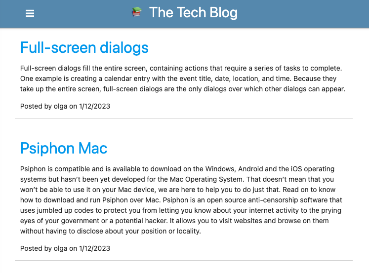
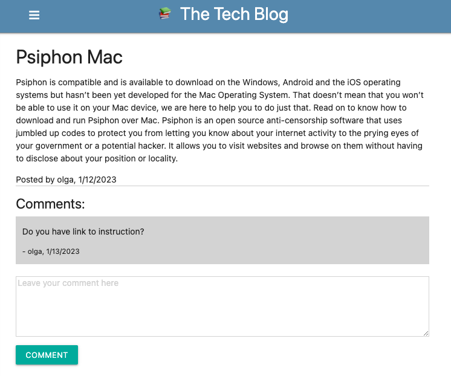

  # Share Ideas - The Tech Blog

  

  ## Description
  
  This is multi-user application. It's allow to post and comment blogposts from other users.

  

  ## Table of Contents
 
  - [Installation](#installation)
  - [Usage](#usage)
  - [Credits](#credits)
  - [License](#license)
  - [Questions](#questions)
  - [Contribution](#contribution)
  - [Tests](#tests)
    
  ## Installation
  
  Application deployed to heroku: https://share-ideas-tech-blog.herokuapp.com/

  If you want to run locally:

  1. Download repo
  2. Update environment variables: `.env`
  3. install dependencies `npm install`
  4. create db from `db\schema.sql` 
  5. run application `npm start`
  
  ## Usage
  
  Open application: https://share-ideas-tech-blog.herokuapp.com/
  
  You can see posts without signup/login. However if you want to add comment - you need to signup to this application.

  Signup/Login to the application. 
  
   - home page: posts from all users. 

   - dashboard: personal posts.
   
   To read and comment post - open post from home page. 

   

   Navigate to dashboard if you want to add / edit / delete personal posts. 
  
  ## Credits
  
  - Olga Gavrushenko

  - Learning materials [Berkley Extension: coding bootcamp](https://extension.berkeley.edu/)
  
  - Instructor: Robert Wijtman
  
  ## License
  
  

  This application is available under the license: MIT License. 

    See the LICENSE file for more info. Full details available by link https://choosealicense.com/licenses/mit/. 
    
 
  ## Questions
  
  Link to my GitHub profile https://github.com/olgagav/
  
  If you have additional questions or proposals please email me: [ogavby@gmail.com](mailto:ogavby@gmail.com?subject=[GitHub]%20command-line%20password%20generator)
    
  ## Contribution

  Contributions are what make the open source community such an amazing place to learn, inspire, and create. Any contributions you make are greatly appreciated. 
  
    - Fork the Project  
    - Create your Feature Branch    
    - Commit your Changes   
    - Push to the Branch    
    - Open Pull Request
  
  ## Tests
  
  n/a
  
